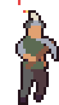
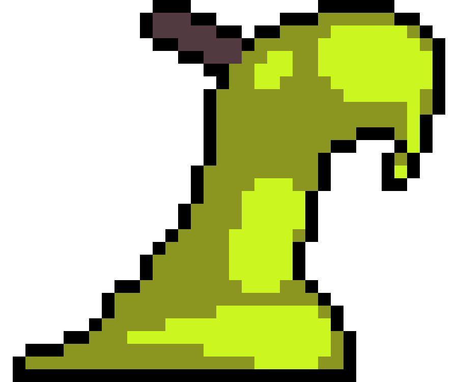
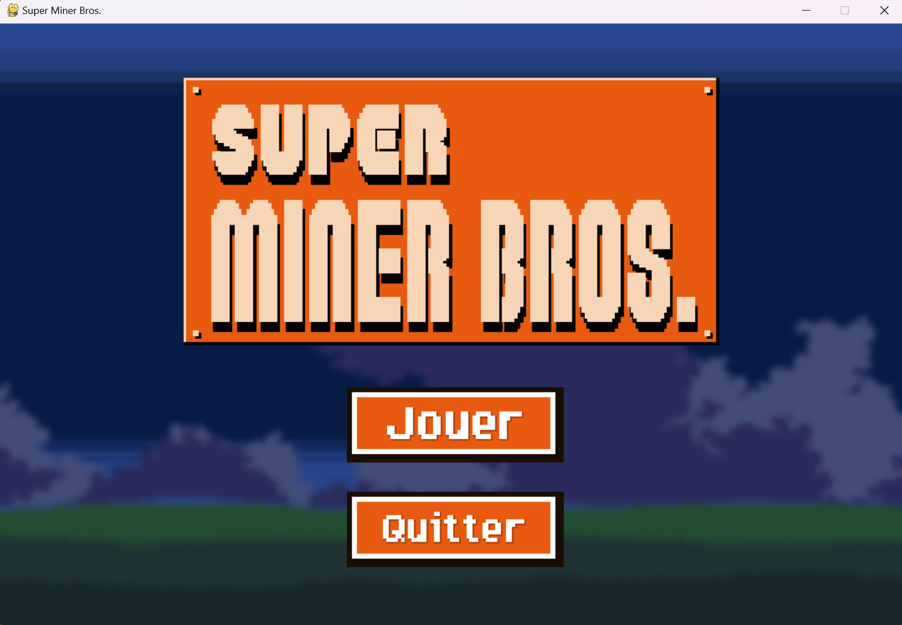

# 🎮 Super Miner Bros - Platform Game

Welcome to the **Super Miner Bros** project, a platformer game developed in **Python** using **Pygame**! 🌟<br>
Embark on an adventure across various levels with interactive features, enemies and collectibles.




## 🤝 Collaborators

### 💻 Developers
- [](https://github.com/ktzkvin)  
- [](https://github.com/Nbleoo)  

### 🎨 Game Designers
- [](https://github.com/oliver2Carglass)  
- [](https://github.com/Rafixol)  

---

## 📋 Features

- 🕹️ **Platformer Gameplay**: Navigate your character through challenging levels with enemies and collectibles.
- 🎨 **Pixel Art Design**: Beautifully crafted assets with animations for players, enemies and objects.
- 🎶 **Immersive Audio**: Background music and sound effects that enhance the game experience.
- 🌌 **Level-Based Progression**: Multiple levels, each with unique challenges and environments.
- 🏆 **Save and Load Profiles**: Store your game progress in one of three profiles.
- 👾 **Enemies and Bosses**: Battle against various enemies and a challenging boss level.
- 🌧️ **Interactive Environments**: Includes rain, moving platforms and screen shake effects.

---

## 🚀 Installation and Setup

### Prerequisites

- Ensure you have **Python 3.8+** and **Pygame** installed.

### Installation

1. Clone the repository:

   ```bash  
   git clone https://github.com/ktzkvin/SuperMinerBros.git  
   cd SuperMinerBros  
   ```

2. Install the required dependencies:

   ```bash  
   pip install -r requirements.txt  
   ```

---

## 🎮 How to Play

1. Run the game:
   
   ```bash  
   python main.py  
   ```

2. Use the following controls:
   - **Arrow Keys**: Move left/right.
   - **Space**: Jump.
   - **Escape**: Pause menu.

3. Progress through levels by completing challenges and defeating enemies. Use keys and crystals to unlock new areas.

---

## 📂 Directory Structure

- **`main.py`**: Main game file containing logic and gameplay.
- **`settings.py`**: Game configurations like screen dimensions and tile sizes.
- **`Niveaux/`**: Level data for the game.
- **`assets/`**: All images, music and animations for the game.
- **`save.txt`**: Stores player progress.

---

## 📊 Game Features

### Level System
Each level introduces new enemies, environments and objectives. Progress is saved automatically.

### Enemies
- **Slimes**: Basic enemies that move left and right.
- **Scorpions**: Faster enemies with different animations.
- **Boss**: The ultimate challenge with unique animations and health mechanics.

### Items
- **Keys**: Collect keys to unlock doors.
- **Crystals**: Special collectibles to progress the story.

### Advanced Features
- **Rain Effects**: Adds visual flair and immersion to some levels.
- **Cinematic Scenes**: Interactive dialogues and animations with characters.

---

## 🖼️ Screenshots

### Menu Screen


### Gameplay


---

## 🧩 Technologies Used

- **Pygame** for the game engine.
- **Python** for logic and implementation.

---
